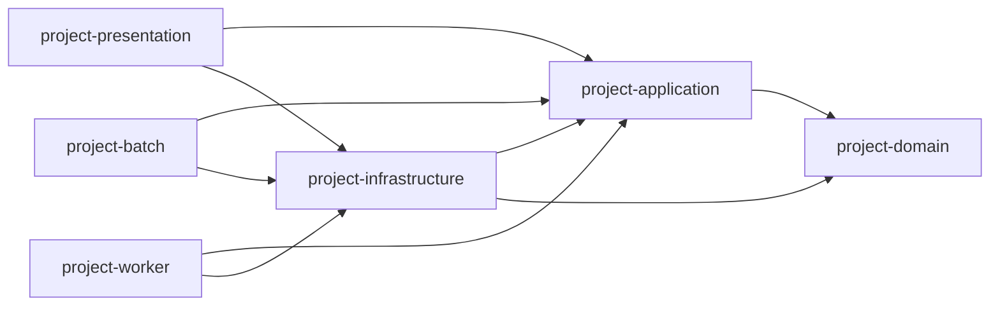

# 모듈구조

## 의존성 방향

`domain`은 다른 프로젝트 모듈에 의존하지 않습니다. 도메인 모델과 업무
규칙은 외부 프레임워크를 참조하지 않습니다.

`application`은 `domain`에만 의존합니다. 유스케이스와 외부 시스템을
사용하기 위한 포트는 `application`에 둡니다.

`infrastructure`는 application 포트를 구현하며 `application`과 `domain`에
의존합니다.

`presentation`, `batch`, `worker`는 `application`과 `infrastructure`에
의존합니다.

JPA, Kotlin JDSL, MySQL과 같은 영속성 기술은 `infrastructure` 안에서만
사용합니다. 해당 라이브러리와 프레임워크 타입은 다른 모듈에 노출하지
않습니다.
