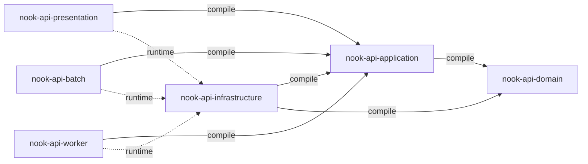

# 모듈구조

## 의존성 방향

아래 도식은 프로젝트 이름이 `nook-api`인 경우의 모듈 의존성을 보여 줍니다.
실선은 컴파일 의존성이고 점선은 런타임 의존성입니다.

`domain`은 다른 프로젝트 모듈에 의존하지 않습니다. 도메인 모델과 업무
규칙은 외부 프레임워크를 참조하지 않습니다.

`application`은 `domain`에만 의존합니다. 유스케이스와 외부 시스템을
사용하기 위한 포트는 `application`에 둡니다.

`infrastructure`는 application 포트를 구현합니다. 구현에 필요한
`application`과 `domain`에 컴파일 의존합니다.

`presentation`, `batch`, `worker`는 `application`에 컴파일 의존하고
`infrastructure`에 런타임 의존합니다. 진입 모듈은 infrastructure 구현을
직접 참조하지 않고 실행 시점에 주입받습니다.

JPA, Kotlin JDSL, MySQL과 같은 영속성 기술은 `infrastructure` 안에서만
사용합니다. 해당 라이브러리와 프레임워크 타입은 다른 모듈에 노출하지
않습니다.
