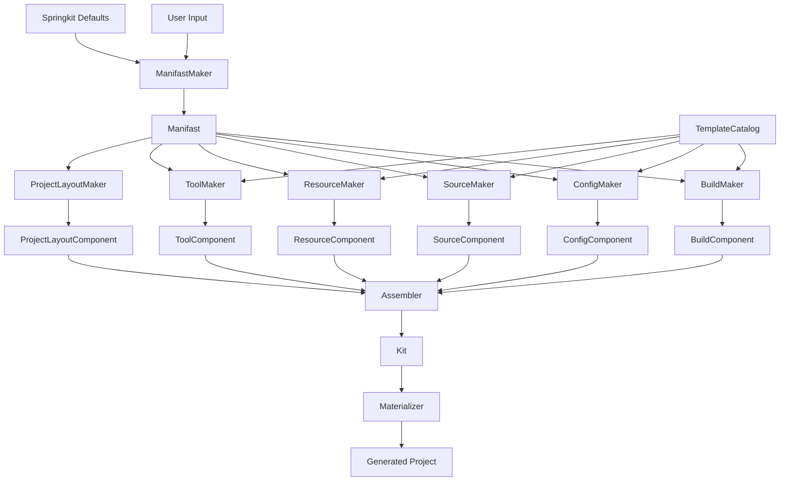
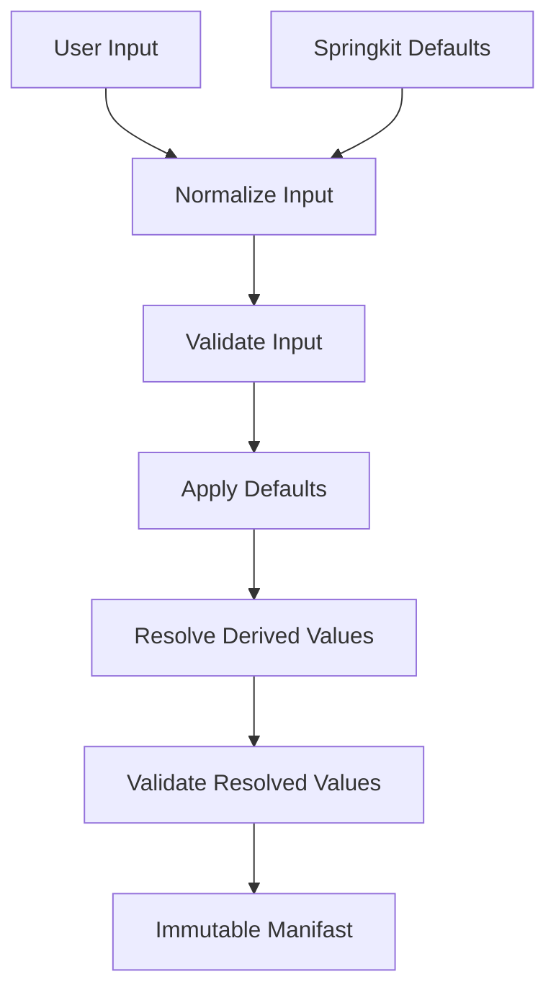
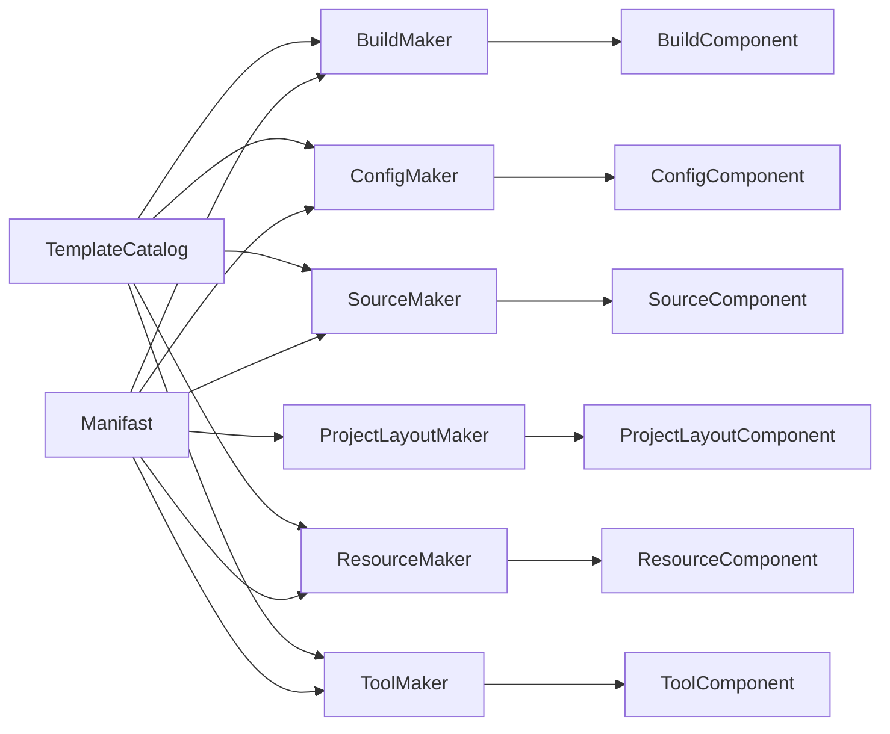
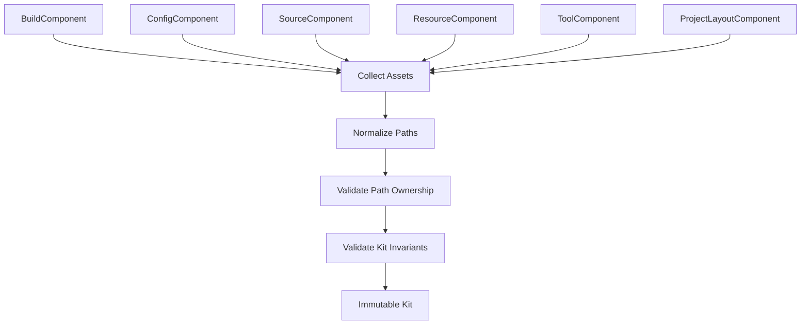
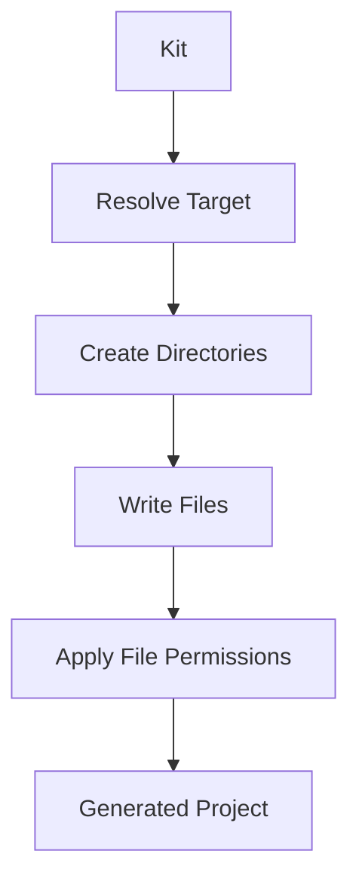
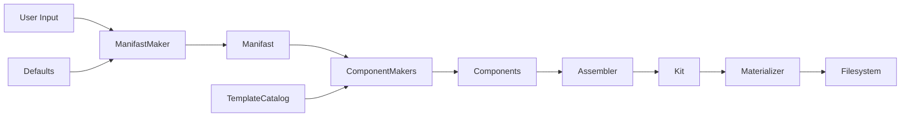
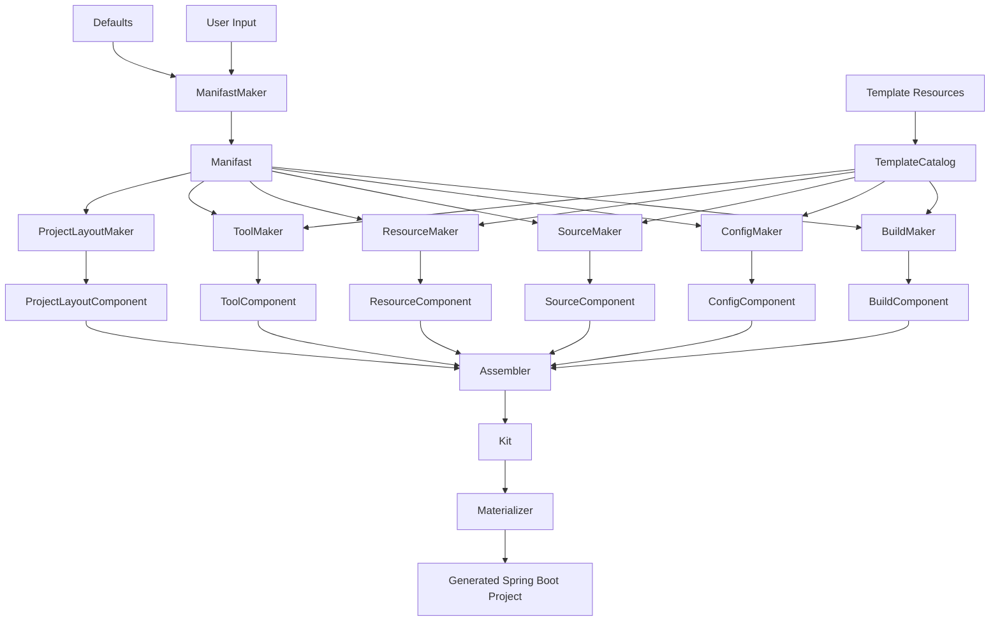

# Springkit Init Component Assembly Specification

- 문서 버전: `0.2`
- 상태: Draft
- 대상 명령: `springkit init`
- 구현 언어: Kotlin
- 아키텍처 형식: Pure Kotlin
- 문장 규칙: ASD-STE100의 단문, 단일 의미, 일관된 용어 원칙을 적용한다.

## 1. 목적

`springkit init`은 개인 개발 규칙이 적용된 Spring Boot 프로젝트를 생성한다.

사용자는 프로젝트마다 달라지는 값을 입력한다.

Springkit은 나머지 설정을 기본값으로 결정한다.

Springkit은 프로젝트 구성을 여러 `Component`로 표현한다.

각 `ComponentMaker`는 하나의 `Component`를 생성한다.

`Assembler`는 모든 `Component`를 하나의 `Kit`으로 결합한다.

`Materializer`는 `Kit`을 파일 시스템에 기록한다.

## 2. 핵심 용어

### 2.1 Manifast

`Manifast`는 프로젝트 생성에 필요한 최종 설정값을 보유한다.

`Manifast`는 사용자 입력값을 포함한다.

`Manifast`는 Springkit 기본값을 포함한다.

`Manifast`는 입력값과 기본값에서 계산한 파생값을 포함한다.

`ManifastMaker`는 모든 값을 확정한 뒤 `Manifast`를 생성한다.

### 2.2 Component

`Component`는 `Kit`을 구성하는 독립 생성 단위다.

v1은 다음 `Component`를 사용한다.

| Component | 책임 |
|---|---|
| `BuildComponent` | Gradle build 파일과 build 설정을 제공한다. |
| `ConfigComponent` | 애플리케이션 설정 파일을 제공한다. |
| `SourceComponent` | main source와 test source를 제공한다. |
| `ResourceComponent` | 프로젝트 공통 resource 파일을 제공한다. |
| `ToolComponent` | Gradle Wrapper와 build tooling 파일을 제공한다. |
| `ProjectLayoutComponent` | 프로젝트 디렉터리와 package 배치 구조를 제공한다. |

### 2.3 ComponentMaker

`ComponentMaker`는 `Manifast`를 사용해서 하나의 `Component`를 생성한다.

Template이 필요한 `ComponentMaker`는 `TemplateCatalog`에서 Template을 읽는다.

각 `ComponentMaker`는 자신이 담당하는 산출물을 완성된 형태로 반환한다.

### 2.4 Template

Template은 Springkit 애플리케이션에 포함된 생성 원본 파일이다.

Template은 `src/main/resources/templates` 아래에서 관리한다.

Template은 replacement token을 사용할 수 있다.

`TemplateRenderer`는 `Manifast` 값을 replacement token에 적용한다.

### 2.5 Assembler

`Assembler`는 완성된 `Component` 집합을 입력으로 받는다.

`Assembler`는 각 `Component`의 asset을 수집한다.

`Assembler`는 path를 정규화한다.

`Assembler`는 path ownership을 검증한다.

`Assembler`는 검증된 asset을 하나의 `Kit`으로 결합한다.

### 2.6 Kit

`Kit`은 완성된 프로젝트의 논리 모델이다.

`Kit`은 모든 directory와 file asset을 보유한다.

`Kit`은 파일 시스템 기록 전에 완성된다.

### 2.7 Materializer

`Materializer`는 `Kit`을 target directory에 기록한다.

`Materializer`는 필요한 directory를 생성한다.

`Materializer`는 file asset을 기록한다.

`Materializer`는 executable permission을 적용한다.

## 3. 전체 DAG



## 4. Manifast Resolution

### 4.1 책임

`ManifastMaker`는 사용자 입력과 Springkit 기본값을 결합한다.

`ManifastMaker`는 파생값을 계산한다.

`ManifastMaker`는 최종 설정을 검증한다.

`ManifastMaker`는 immutable `Manifast`를 생성한다.

### 4.2 Resolution DAG



### 4.3 사용자 입력

v1은 다음 입력을 받는다.

- project name
- group
- artifact
- package name

CLI는 각 입력에 기본 제안을 표시할 수 있다.

사용자는 필요한 값만 수정한다.

### 4.4 기본값

Springkit은 다음 값을 기본값으로 제공한다.

- Spring Boot version
- Kotlin version
- Gradle version
- Java Toolchain version
- dependency set
- Spring REST Docs 설정
- test 설정
- compiler 설정
- application 설정
- project layout 규칙

Java Toolchain의 기본값은 `21`이다.

Springkit은 현재 실행 환경에서 사용할 수 있는 JVM으로 Gradle을 실행한다.

### 4.5 파생값

`ManifastMaker`는 다음 값을 계산할 수 있다.

- package path
- application class name
- project target directory
- Gradle distribution URL
- Gradle distribution checksum URL
- Template replacement values

## 5. Manifast 모델

`Manifast`는 다음 영역으로 구성할 수 있다.

```yaml
identity:
  name:
  group:
  artifact:
  packageName:

platform:
  javaVersion:
  springBootVersion:
  kotlinVersion:

build:
  gradleVersion:
  dependencies:
  restDocs:
  testing:
  compiler:

layout:
  projectRoot:
  mainSourceRoot:
  testSourceRoot:
  resourceRoot:
  packagePath:
```

실제 Kotlin 모델은 응집된 value object로 각 영역을 표현한다.

### 5.1 Manifast 요구사항

`MAN-001` `ManifastMaker`는 모든 필수 generation 값을 결정해야 한다.

`MAN-002` `Manifast`는 immutable 값 객체로 제공해야 한다.

`MAN-003` 모든 `ComponentMaker`는 동일한 `Manifast`를 입력으로 사용해야 한다.

`MAN-004` 기본값 resolution은 `ManifastMaker`에서 완료해야 한다.

`MAN-005` 파생값 계산은 `ManifastMaker`에서 완료해야 한다.

`MAN-006` 동일한 입력과 동일한 기본값은 동일한 `Manifast`를 생성해야 한다.

## 6. Template Resource

### 6.1 디렉터리 구조

Template은 다음 구조로 관리한다.

```text
src/main/resources/templates/
    build/
    config/
    source/
    resource/
    tool/
```

각 Template group은 해당 `ComponentMaker`가 사용한다.

### 6.2 Template 역할

`build` Template은 Gradle build 파일을 제공한다.

`config` Template은 application configuration 파일을 제공한다.

`source` Template은 main source와 test source를 제공한다.

`resource` Template은 `.gitignore`, `.editorconfig` 같은 공통 파일을 제공한다.

`tool` Template은 정적 tooling asset을 제공할 수 있다.

### 6.3 Replacement

Template은 다음과 같은 token을 사용할 수 있다.

```text
{{project.name}}
{{project.group}}
{{project.artifact}}
{{project.package}}
{{java.version}}
{{gradle.version}}
{{springBoot.version}}
{{kotlin.version}}
```

`TemplateRenderer`는 `Manifast`의 확정된 값으로 token을 교체한다.

### 6.4 Template 요구사항

`TMP-001` `TemplateCatalog`는 logical path로 Template을 제공해야 한다.

`TMP-002` `TemplateRenderer`는 모든 token을 확정된 값으로 교체해야 한다.

`TMP-003` `TemplateRenderer`는 rendering 결과를 memory asset으로 반환해야 한다.

`TMP-004` `ComponentMaker`는 필요한 Template의 logical path를 소유해야 한다.

`TMP-005` Template의 결과 path는 해당 `ComponentMaker`가 결정해야 한다.

## 7. Component 공통 모델

모든 `Component`는 공통 assembly 모델을 제공한다.

개념 모델은 다음과 같다.

```yaml
component:
  id:
  type:
  directories: []
  files: []

fileAsset:
  path:
  content:
  executable:
```

`Component` type은 다음 값을 사용할 수 있다.

- `BUILD`
- `CONFIG`
- `SOURCE`
- `RESOURCE`
- `TOOL`
- `PROJECT_LAYOUT`

### 7.1 공통 요구사항

`COM-001` 각 `Component`는 stable id를 가져야 한다.

`COM-002` 각 file asset은 project root 기준 상대 path를 가져야 한다.

`COM-003` 각 file asset은 완성된 content를 가져야 한다.

`COM-004` executable file은 executable 속성을 가져야 한다.

`COM-005` 각 `Component`는 자신이 제공하는 output path를 소유해야 한다.

`COM-006` 각 `ComponentMaker`는 하나의 component 책임 영역을 처리해야 한다.

## 8. BuildComponent

`BuildComponent`는 build system 산출물을 제공한다.

v1은 Gradle Kotlin DSL을 사용한다.

`BuildComponent`는 다음 파일을 제공할 수 있다.

- `build.gradle.kts`
- `settings.gradle.kts`
- `gradle.properties`

`BuildMaker`는 Springkit의 기본 build convention을 Template에 적용한다.

기본 build convention은 다음 항목을 포함한다.

- Java Toolchain 21
- Spring Boot plugin
- Kotlin plugins
- 기본 dependency set
- Spring REST Docs dependency
- Spring REST Docs task 설정
- test task 설정
- compiler 설정

### 8.1 Build 요구사항

`BLD-001` `BuildMaker`는 build 관련 `Manifast` 값을 읽어야 한다.

`BLD-002` `BuildMaker`는 build Template을 rendering해야 한다.

`BLD-003` `BuildMaker`는 완성된 build file asset을 생성해야 한다.

`BLD-004` `BuildComponent`는 build 관련 output path를 소유해야 한다.

## 9. ConfigComponent

`ConfigComponent`는 애플리케이션 설정 파일을 제공한다.

예시는 다음과 같다.

- `src/main/resources/application.yml`
- `src/test/resources/application.yml`

### 9.1 Config 요구사항

`CFG-001` `ConfigMaker`는 config Template을 rendering해야 한다.

`CFG-002` `ConfigMaker`는 environment별 기본 설정을 적용할 수 있다.

`CFG-003` `ConfigComponent`는 application configuration path를 소유해야 한다.

## 10. SourceComponent

`SourceComponent`는 main source와 test source를 제공한다.

`SourceMaker`는 `Manifast`의 package 정보를 사용한다.

`SourceMaker`는 package path를 target file path에 적용한다.

Spring REST Docs용 공통 test source가 기본 규칙에 포함되면 `SourceMaker`가 해당 source를 생성한다.

### 10.1 Source 요구사항

`SRC-001` `SourceMaker`는 source Template을 rendering해야 한다.

`SRC-002` `SourceMaker`는 package path를 source path에 적용해야 한다.

`SRC-003` `SourceMaker`는 main source asset을 생성해야 한다.

`SRC-004` `SourceMaker`는 기본 test source asset을 생성해야 한다.

`SRC-005` `SourceComponent`는 source output path를 소유해야 한다.

## 11. ResourceComponent

`ResourceComponent`는 프로젝트 공통 resource file을 제공한다.

예시는 다음과 같다.

- `.gitignore`
- `.editorconfig`
- repository 공통 설정 파일

### 11.1 Resource 요구사항

`RES-001` `ResourceMaker`는 resource Template을 읽어야 한다.

`RES-002` `ResourceMaker`는 replacement가 필요한 resource를 rendering해야 한다.

`RES-003` `ResourceMaker`는 정적 resource를 file asset으로 제공해야 한다.

`RES-004` `ResourceComponent`는 공통 resource output path를 소유해야 한다.

## 12. ToolComponent

`ToolComponent`는 project build tooling을 제공한다.

Gradle 기준 asset은 다음과 같다.

- `gradlew`
- `gradlew.bat`
- `gradle/wrapper/gradle-wrapper.jar`
- `gradle/wrapper/gradle-wrapper.properties`

`ToolMaker`는 `Manifast`의 Gradle version을 사용한다.

`ToolMaker`는 Springkit이 확보한 Gradle distribution으로 Wrapper를 생성할 수 있다.

`ToolMaker`는 공식 distribution 정보로 Wrapper 설정을 구성할 수 있다.

### 12.1 Tool 요구사항

`TOL-001` `ToolMaker`는 `Manifast`의 Gradle version을 사용해야 한다.

`TOL-002` `ToolMaker`는 Gradle Wrapper asset을 생성해야 한다.

`TOL-003` `ToolMaker`는 executable 속성을 `gradlew`에 적용해야 한다.

`TOL-004` `ToolComponent`는 build tooling output path를 소유해야 한다.

## 13. ProjectLayoutComponent

`ProjectLayoutComponent`는 프로젝트의 논리적인 배치 구조를 제공한다.

`ProjectLayoutMaker`는 `Manifast`의 layout 값을 사용한다.

`ProjectLayoutComponent`는 다음 directory를 포함할 수 있다.

- main source root
- test source root
- main resource root
- test resource root
- package directory

### 13.1 Project Layout 요구사항

`LAY-001` `ProjectLayoutMaker`는 project layout을 directory asset으로 변환해야 한다.

`LAY-002` `ProjectLayoutMaker`는 package path를 source layout에 적용해야 한다.

`LAY-003` `ProjectLayoutComponent`는 명시적인 project directory 구조를 제공해야 한다.

`LAY-004` file asset은 자신의 전체 target path를 제공해야 한다.

## 14. Component Generation DAG



각 `ComponentMaker`는 동일한 resolution 결과를 공유한다.

각 `ComponentMaker`는 독립된 component 결과를 생성한다.

## 15. Assembler

`Assembler`는 `Component` 집합을 `Kit`으로 결합한다.

`Assembler`는 다음 순서를 사용한다.

1. Component를 수집한다.
2. Directory asset을 수집한다.
3. File asset을 수집한다.
4. 모든 path를 정규화한다.
5. Path ownership을 검증한다.
6. Kit invariant를 검증한다.
7. Immutable `Kit`을 생성한다.

### 15.1 Assembly DAG



### 15.2 Assembler 요구사항

`ASM-001` `Assembler`는 완성된 `Component` 집합을 입력으로 받아야 한다.

`ASM-002` `Assembler`는 모든 asset path를 project root 기준으로 정규화해야 한다.

`ASM-003` `Assembler`는 하나의 output path에 하나의 owner를 확정해야 한다.

`ASM-004` 중복 path를 발견하면 `Assembler`는 명시적인 conflict error를 반환해야 한다.

`ASM-005` `Assembler`는 component 입력 순서와 독립적인 결과를 생성해야 한다.

`ASM-006` `Assembler`는 검증된 asset으로 immutable `Kit`을 생성해야 한다.

## 16. Path Ownership

하나의 output path는 하나의 `Component`가 소유한다.

예시는 다음과 같다.

| Path | Owner |
|---|---|
| `build.gradle.kts` | `BuildComponent` |
| `settings.gradle.kts` | `BuildComponent` |
| `src/main/resources/application.yml` | `ConfigComponent` |
| `src/main/kotlin/.../Application.kt` | `SourceComponent` |
| `.editorconfig` | `ResourceComponent` |
| `gradlew` | `ToolComponent` |

Spring REST Docs 설정은 `BuildMaker`가 `BuildComponent`에 적용한다.

Spring REST Docs test source가 필요하면 `SourceMaker`가 `SourceComponent`에 적용한다.

이 규칙은 각 output file에 하나의 책임 owner를 제공한다.

## 17. Kit

`Kit`은 assembly가 완료된 immutable project model이다.

`Kit`은 다음 데이터를 포함한다.

```yaml
kit:
  directories: []
  files: []
```

각 file은 다음 정보를 포함한다.

```yaml
file:
  path:
  content:
  executable:
  owner:
```

### 17.1 Kit 요구사항

`KIT-001` 모든 file asset은 normalized path를 가져야 한다.

`KIT-002` 모든 file asset은 하나의 owner를 가져야 한다.

`KIT-003` 모든 Template token은 component generation 단계에서 확정해야 한다.

`KIT-004` `Kit`은 deterministic ordering으로 asset을 보유해야 한다.

`KIT-005` `Kit`은 materialization에 필요한 모든 정보를 제공해야 한다.

## 18. Materialization

`Materializer`는 `Kit`을 target directory에 기록한다.

### 18.1 Materialization DAG



### 18.2 Materializer 요구사항

`MAT-001` `Materializer`는 target directory를 확정해야 한다.

`MAT-002` `Materializer`는 `Kit`의 directory asset을 생성해야 한다.

`MAT-003` `Materializer`는 file asset의 parent directory를 생성해야 한다.

`MAT-004` `Materializer`는 file asset content를 지정된 path에 기록해야 한다.

`MAT-005` `Materializer`는 executable 속성을 file permission에 적용해야 한다.

`MAT-006` `Materializer`는 기록 결과를 generation result로 반환해야 한다.

## 19. Init Orchestration

`Init`은 generation use case를 조정한다.

Language-free pseudo code는 다음과 같다.

```text
function init(userInput):
    manifast = manifastMaker.make(userInput, defaults)

    components = [
        buildMaker.make(manifast),
        configMaker.make(manifast),
        sourceMaker.make(manifast),
        resourceMaker.make(manifast),
        toolMaker.make(manifast),
        projectLayoutMaker.make(manifast)
    ]

    kit = assembler.assemble(components)

    result = materializer.materialize(kit)

    return result
```

### 19.1 Init 요구사항

`INI-001` `Init`은 사용자 입력을 `ManifastMaker`에 전달해야 한다.

`INI-002` `Init`은 생성된 `Manifast`를 모든 `ComponentMaker`에 전달해야 한다.

`INI-003` `Init`은 모든 `Component`를 수집해야 한다.

`INI-004` `Init`은 `Component` 집합을 `Assembler`에 전달해야 한다.

`INI-005` `Init`은 생성된 `Kit`을 `Materializer`에 전달해야 한다.

`INI-006` `Init`은 materialization 결과를 사용자에게 반환해야 한다.

## 20. 책임 경계

| 객체 | 책임 |
|---|---|
| `ManifastMaker` | 사용자 입력, 기본값, 파생값을 하나의 최종 설정으로 resolve한다. |
| `Manifast` | 확정된 generation 값을 제공한다. |
| `TemplateCatalog` | logical path로 Template을 제공한다. |
| `TemplateRenderer` | Template token을 Manifast 값으로 교체한다. |
| `BuildMaker` | build 산출물을 생성한다. |
| `ConfigMaker` | application config 산출물을 생성한다. |
| `SourceMaker` | source 산출물을 생성한다. |
| `ResourceMaker` | 공통 resource 산출물을 생성한다. |
| `ToolMaker` | Gradle tooling 산출물을 생성한다. |
| `ProjectLayoutMaker` | project layout 산출물을 생성한다. |
| `Component` | 하나의 생성 책임 영역의 완성된 asset을 제공한다. |
| `Assembler` | 모든 Component를 검증하고 하나의 Kit으로 결합한다. |
| `Kit` | 완성된 논리 프로젝트를 제공한다. |
| `Materializer` | Kit을 파일 시스템에 기록한다. |

## 21. Dependency Direction



의존성은 generation 단계의 진행 방향을 따른다.

각 단계는 다음 단계가 사용할 완성된 결과를 제공한다.

## 22. Determinism

Springkit은 같은 generation 조건에서 같은 `Kit`을 생성해야 한다.

Generation 조건은 다음 항목으로 정의한다.

- 동일한 User Input
- 동일한 Springkit Defaults
- 동일한 Template Resources
- 동일한 Springkit version
- 동일한 tool artifact version

`Assembler`는 asset을 deterministic order로 정렬해야 한다.

`ComponentMaker`는 동일한 입력에 동일한 component 결과를 생성해야 한다.

## 23. 오류 처리

Springkit은 오류를 generation 단계의 책임에 맞게 분류한다.

| Error | 발생 단계 | 처리 |
|---|---|---|
| Invalid input | `ManifastMaker` | 입력 항목과 원인을 반환한다. |
| Invalid resolved value | `ManifastMaker` | 설정 항목과 원인을 반환한다. |
| Missing Template | `ComponentMaker` | Template logical path를 반환한다. |
| Unresolved Template token | `TemplateRenderer` | token과 Template path를 반환한다. |
| Component path conflict | `Assembler` | path와 owner 목록을 반환한다. |
| Invalid target | `Materializer` | target path와 원인을 반환한다. |
| Tool bootstrap failure | `ToolMaker` | tool version과 실행 원인을 반환한다. |

## 24. v1 지원 범위

Springkit v1은 다음 구성을 지원한다.

- Pure Kotlin init implementation
- Kotlin Spring Boot project
- Gradle Kotlin DSL
- Java Toolchain 21
- 현재 실행 환경의 JVM
- 고정 Spring Boot 기본 버전
- 고정 Kotlin 기본 버전
- 고정 Gradle 기본 버전
- 기본 dependency set
- Spring REST Docs 기본 구성
- 기본 test 구성
- 기본 compiler 구성
- Template replacement 기반 파일 생성
- Component 단위 project 구성
- Assembler 기반 Kit 결합
- File system materialization

## 25. 기준 Architecture



## 26. 핵심 규칙

`SPEC-001` `Manifast`는 사용자 입력, 기본값, 파생값을 하나의 최종 설정으로 제공해야 한다.

`SPEC-002` 각 `ComponentMaker`는 하나의 책임 영역을 완성된 `Component`로 만들어야 한다.

`SPEC-003` Template은 Springkit resource에서 관리해야 한다.

`SPEC-004` Template의 동적 값은 `Manifast`에서 가져와야 한다.

`SPEC-005` 하나의 output path는 하나의 `Component`가 소유해야 한다.

`SPEC-006` `Assembler`는 완성된 `Component`를 하나의 immutable `Kit`으로 결합해야 한다.

`SPEC-007` `Materializer`는 `Kit`을 파일 시스템에 기록해야 한다.

`SPEC-008` Springkit은 동일한 generation 조건에서 동일한 `Kit`을 생성해야 한다.
