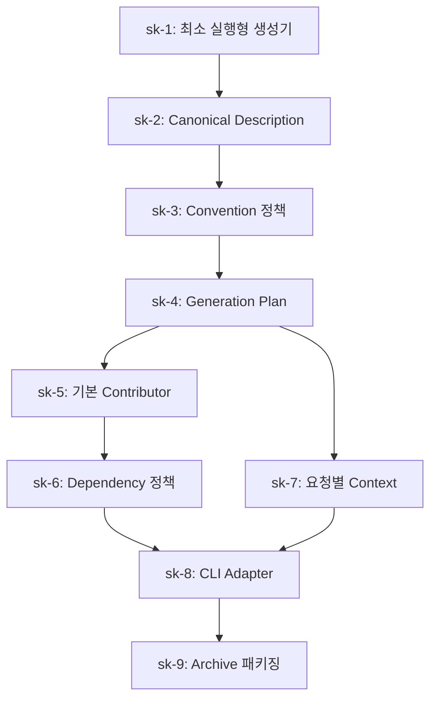

# SpringKit Task DAG

이 디렉터리는 `spring-initializr-init-internals.md`에서 추출한 개인용 initializer 구현을 배포 가능한 Task로 나눈다.

## Namespace 원칙

- 소유 도메인과 사용자 표시 주소의 기본값은 `jeongrae.me`다.
- JVM group과 package root는 역도메인 `me.jeongrae`를 사용한다.
- SpringKit 자체의 기본 package는 `me.jeongrae.springkit`이다.

## DAG

## Task 목록

| Task | Goal | 선행 Task |
|---|---|---|
| [sk-1](sk-1.md) | 고정된 최소 프로젝트를 생성하는 실행 가능한 애플리케이션 제공 | 없음 |
| [sk-2](sk-2.md) | 외부 입력과 생성 코어 사이에 canonical description 경계 도입 | sk-1 |
| [sk-3](sk-3.md) | sparse input을 완전한 description으로 확장 | sk-2 |
| [sk-4](sk-4.md) | 최종 description으로 결정적인 generation plan 구성 | sk-3 |
| [sk-5](sk-5.md) | 실제로 빌드 가능한 프로젝트 파일 생성 | sk-4 |
| [sk-6](sk-6.md) | 의존성 식별자 해석과 호환성 정책 중앙화 | sk-5 |
| [sk-7](sk-7.md) | 생성 요청별 상태와 수명주기 격리 | sk-4 |
| [sk-8](sk-8.md) | 생성 코어를 CLI 사용자 인터페이스로 제공 | sk-6, sk-7 |
| [sk-9](sk-9.md) | 생성 결과를 재현 가능한 ZIP archive로 제공 | sk-8 |

`sk-6`과 `sk-7`은 서로 독립적이며 선행 조건이 충족되면 병렬 수행할 수 있다.
